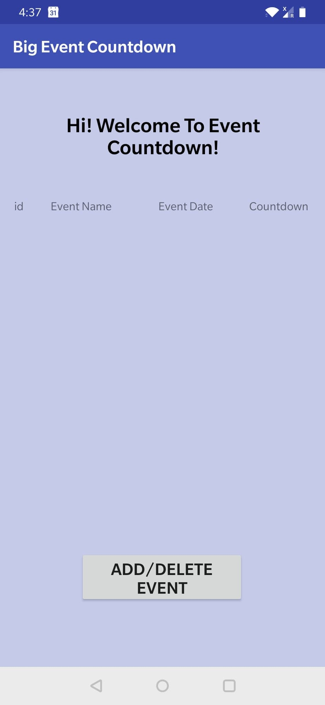
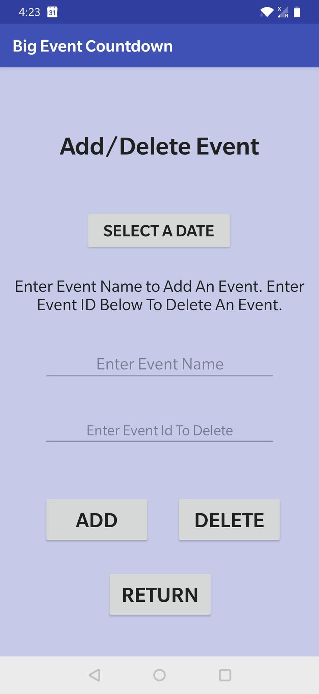

# Big-Event-Countdown-Android-Development
This is my final project for Programming Languages. It's an android app that countdown the big event. It's written in Java with Android Studio. 

App Name: "Big Event Countdown"

It requires 2 inputes from user. 
1.Date of event
2.Name of event.

Then, it creates a database and store the event in the database.
Everytime, user open the app, it shows the data from the database.

Function:
User can add events by entering event name.
User can delete events by entering event id.

Database type: SQlite

<!--- HTML markdown to center the image --->

    
    

